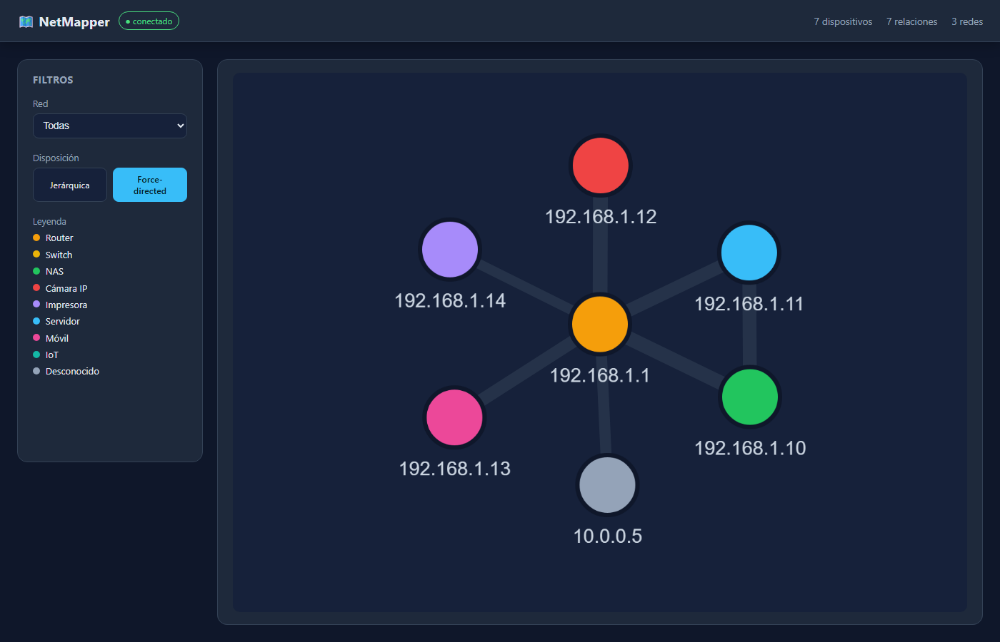
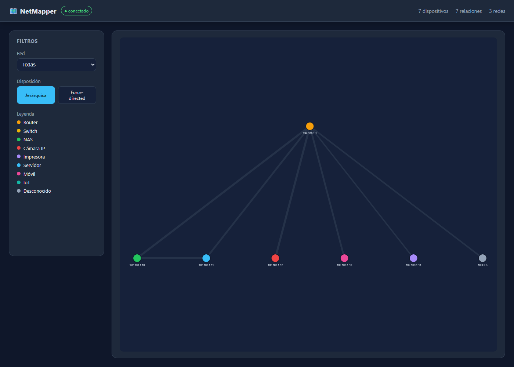
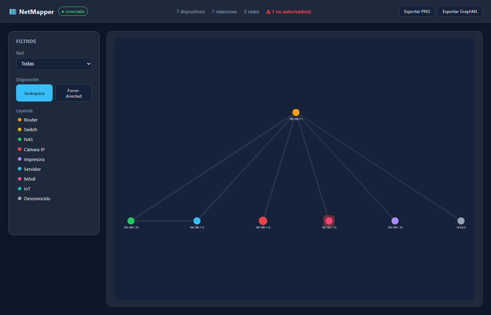
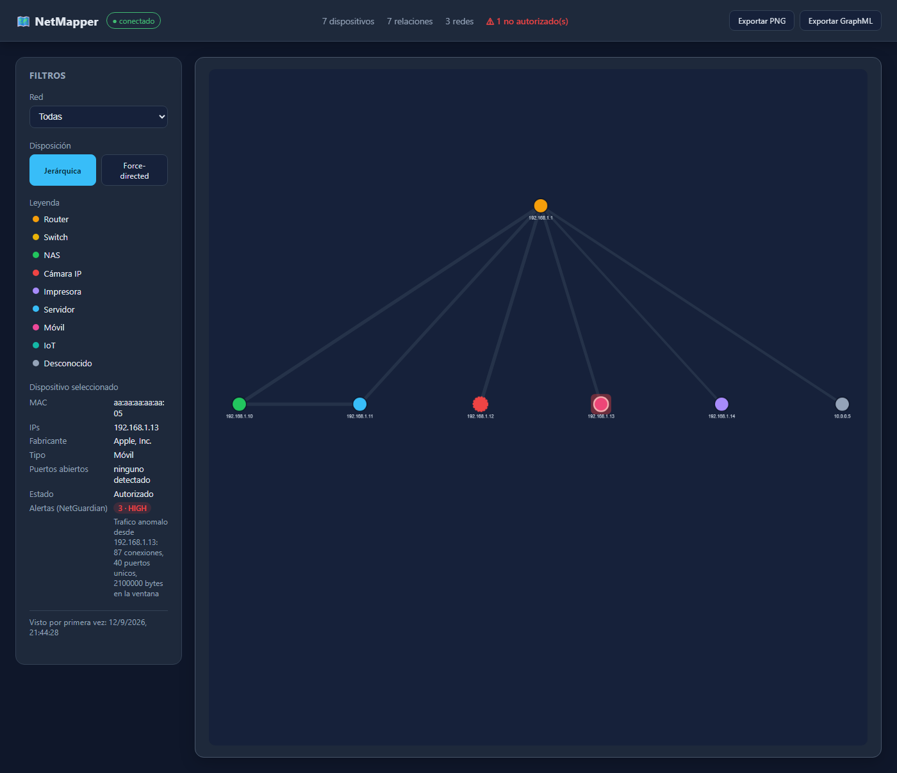

# 🗺️ NetMapper — Automatic Multi-Segment Network Discovery & Topology Mapping

> A tool that automatically detects every network reachable from your machine — even across different ranges (192.168.0.x, 192.168.1.x, 10.0.0.x, 172.26.0.x...) — discovers the devices on each one by combining active and passive techniques, and builds an interactive, always-up-to-date topology map.

---

## 📋 Table of contents

1. [Motivation & scope](#-motivation--scope)
2. [Legal & ethical considerations](#-legal--ethical-considerations)
3. [Architecture](#-architecture)
4. [Detailed program walkthrough](#-detailed-program-walkthrough)
5. [Tech stack](#-tech-stack)
6. [Repository structure](#-repository-structure)
7. [Roadmap & commit plan](#-roadmap--commit-plan)
8. [Installation guide](#-installation-guide)
9. [Getting it running](#-getting-it-running)
10. [Using the dashboard](#-using-the-dashboard)
11. [Screenshots](#-screenshots)
12. [Testing](#-testing)
13. [Built-in enhancements](#-built-in-enhancements)
14. [Future improvements](#-future-improvements)
15. [License](#-license)

---

## 🎯 Motivation & scope

Most network scanning tools assume you're working on a single, manually-configured range (`192.168.1.0/24`). Real networks — homelabs with VLANs, Docker, VPNs, or corporate networks — have several segments alive at once, and you usually don't know all of them up front.

**NetMapper** solves this in two stages:

1. **Discovers which networks exist and are reachable** from the machine it runs on, without you having to list them by hand.
2. **Maps every discovered network**, combining active discovery (ARP/NDP, ICMP, SNMP, port scanning) with passive discovery (traffic capture), and builds an interactive topology graph that keeps itself up to date.

The end result is a web dashboard where you can see, in real time, every reachable device in your environment, grouped by network, with their actual communication relationships — plus (see [Built-in enhancements](#-built-in-enhancements)) which devices aren't on your authorized list, which ones an IDS has flagged as anomalous, and how each device's fingerprint has changed over time.

---

## ⚖️ Legal & ethical considerations

This needs to be explicit in the repository itself (and it's worth bringing up in any interview about this project):

- This tool is meant **exclusively for auditing networks you own** (your homelab, your home network, or a network you have explicit authorization to scan).
- Actively scanning networks that aren't yours without permission is **illegal** in most countries.
- `ALLOWED_NETWORKS` isn't a cosmetic setting — it's the actual safety gate. Any network the pipeline detects but that isn't listed there gets recorded as "known" and is **never** actively scanned. See [`_apply_device_authorization`/`is_network_allowed`](#-detailed-program-walkthrough) below for exactly how that's enforced in code, not just in this paragraph.

---

## 🏗️ Architecture

```
┌──────────────────────────────────────────────────────────────────┐
│                  STAGE 0 — NETWORK DISCOVERY                     │
│  Local interfaces (IPv4+IPv6) · Routing table · Router queries · │
│  Whitelist check against ALLOWED_NETWORKS                        │
└───────────────────────────────┬────────────────────────────────────┘
                                 │  authorized target subnets
┌───────────────────────────────▼────────────────────────────────────┐
│                  STAGE 1 — HOST DISCOVERY                          │
│  ARP (local IPv4) · NDP/ICMPv6 (local IPv6) · async TCP (remote)  │
└───────────────────────────────┬────────────────────────────────────┘
                                 │  live hosts per subnet
┌───────────────────────────────▼────────────────────────────────────┐
│              STAGE 2 — DEVICE FINGERPRINTING                      │
│  Selective port scanning · OUI/MAC vendor lookup ·                │
│  mDNS/UPnP listening · rule-based device-type inference           │
└───────────────────────────────┬────────────────────────────────────┘
                                 │  per-device metadata
┌───────────────────────────────▼────────────────────────────────────┐
│              STAGE 3 — PASSIVE DISCOVERY                          │
│  Traffic capture (Scapy, IPv4+IPv6) · DNS query analysis ·        │
│  "who talks to whom" relationships                                │
└───────────────────────────────┬────────────────────────────────────┘
                                 │
┌───────────────────────────────▼────────────────────────────────────┐
│              STAGE 4 — FUSION ENGINE                              │
│  Merges every source into one coherent graph model, resolving    │
│  conflicts (DHCP-reassigned IPs, duplicates), tracking            │
│  authorization + correlated security alerts per device            │
└───────────────────────────────┬────────────────────────────────────┘
                                 │
┌───────────────────────────────▼────────────────────────────────────┐
│              STAGE 5 — GRAPH ANALYSIS                             │
│  Community detection (Louvain) · Betweenness centrality ·         │
│  Hierarchy inference (hop-count layers)                           │
└───────────────────────────────┬────────────────────────────────────┘
                                 │
┌───────────────────────────────▼────────────────────────────────────┐
│              STAGE 6 — PERSISTENCE                                │
│  SQLite today (Repository interface; Neo4jRepository is an        │
│  explicit stub for a real graph database later)                  │
└───────────────────────────────┬────────────────────────────────────┘
                                 │
┌───────────────────────────────▼────────────────────────────────────┐
│              STAGE 7 — BACKEND API                                │
│  FastAPI + WebSocket — serves the graph and pushes live updates  │
└───────────────────────────────┬────────────────────────────────────┘
                                 │
┌───────────────────────────────▼────────────────────────────────────┐
│              STAGE 8 — FRONTEND                                   │
│  React + Cytoscape.js — interactive map, network/layer filters,  │
│  time-lapse, PNG/GraphML export, unauthorized-device and         │
│  security-alert overlays                                          │
└──────────────────────────────────────────────────────────────────┘
                                 │
                    ┌────────────▼────────────┐
                    │   NetGuardian (optional)  │
                    │   IDS anomaly alerts,     │
                    │   polled and correlated   │
                    │   by source IP            │
                    └───────────────────────────┘
```

**Why it grew past the original plan:** a `common/` package appeared early on so discovery, analysis and backend could share configuration, persistence and severity logic without duplicating it (the same pattern used in [NetGuardian](https://github.com/gsan-dev/NetGuardian)), and Neo4j was deliberately deprioritized in favor of SQLite-first — see the [database note](#️-installation-guide) below.

---

## 🔬 Detailed program walkthrough

This section explains **what each module actually does internally** and why it's built that way — the part worth understanding well enough to defend in an interview.

### `network_discovery.py` — Network discovery (Stage 0)

Answers "which networks am I on, and which can I reach?" by combining three sources, from least to most authoritative:

- **Routing table** (`pyroute2`, Linux only, both `AF_INET` and `AF_INET6`): reveals networks that are *not* directly connected but reachable through a gateway — this is what lets you see a 10.0.0.x network even though your machine sits physically on 192.168.1.x.
- **Local interfaces** (`netifaces`): every network interface (Ethernet, Wi-Fi, VPN, Docker bridges) has its own IP+mask, from which a directly-connected CIDR is derived — IPv4 and IPv6 addresses alike (IPv6 link-local addresses, including the `%iface` scope-id netifaces attaches to them, are correctly excluded).
- **SNMP query to a managed router** (optional, IPv4 only — `ipAddrTable` is a classic MIB-II table; IPv6 would need RFC 4293's `ipAddressTable`, not implemented): the most reliable source when available, since the router knows its configured subnets/VLANs with certainty.

When two sources describe the same network, the more reliable one wins, but every distinct CIDR is kept.

Every detected network is checked against `ALLOWED_NETWORKS` (`Settings.is_network_allowed`) and persisted either way — authorized ones get actively scanned, the rest are recorded as "known" and never touched.

### `host_discovery.py` — Host discovery (Stage 1)

Picks a technique per subnet instead of applying the same one everywhere:

- **Directly-connected IPv4**: ARP scan (layer 2) — near-instant and very reliable within the same physical segment.
- **Directly-connected IPv6**: ARP doesn't exist in IPv6 (NDP replaces it), and a typical /64 has 2⁶⁴ addresses — far too many to brute-force. Instead, an ICMPv6 Echo Request goes out to the link's all-nodes multicast address (`ff02::1`), and every live host on the link answers with its own source address.
- **Remote networks** (IPv4 or IPv6, reachable only through routing): neither ARP nor link-local multicast reach past the local segment, so an async TCP probe against common ports is used instead (a RST also counts as "host alive"). A configurable size cap skips subnets too large to probe reasonably (a remote /64 is never brute-forced).

### `device_fingerprint.py` — Device characterization (Stage 2)

For every live host:
- Resolves the vendor from the first bytes of the MAC (IEEE OUI database, via `manuf`).
- Runs a selective (not exhaustive, to stay non-aggressive) port scan over the most common ports.
- Combines vendor + open ports through a simple, explainable scoring rule engine (`common/device_types.py`) to infer the device type (router, NAS, IP camera, printer, server, mobile, IoT...).
- Passively listens for mDNS/UPnP announcements, which many home devices broadcast on their own — free fingerprinting information without having to scan actively.

### `passive_capture.py` — Passive discovery (Stage 3)

Using Scapy in listen mode, groups observed traffic by IP pair into time windows, producing edges of the form `(source, destination, bytes, connection_count)` — this is what lets the map show **real communication relationships**, not just presence. It parses both IPv4 and IPv6 packets, and also tracks which domains each source IP resolves via DNS — a free fingerprinting signal (a device that only resolves Apple domains is probably an iPhone/Mac).

### `fusion_engine.py` — Fusion engine (Stage 4)

The most delicate module in the project. It receives data from the active sources above and from passive capture — which can arrive at different times and with inconsistencies — and:
- Deduplicates devices using the **MAC as the stable identifier** (more reliable than the IP, which can change via DHCP). Hosts without a real MAC (discovered via remote TCP probing, outside the local L2 segment) get an `"unknown-<ip>"` placeholder identity instead.
- Resolves DHCP reassignment: if an IP that belonged to one device is now reported by another, it's reassigned and retired from the previous one.
- Builds the final graph combining nodes (devices) and edges (both active relations and passively observed ones) — an IP with no known device (e.g. an Internet server) is kept as-is as an "external" graph node.
- Tracks each device's authorization status and any correlated security alerts (see [Built-in enhancements](#-built-in-enhancements)) — without knowing about the whitelist or NetGuardian itself, to keep it decoupled from global configuration.

### `graph_analysis.py` — Graph analysis (Stage 5)

Over the already-built graph:
- **Community detection** (Louvain algorithm, via `python-louvain`, weighted by connection count): automatically groups devices that interact heavily with each other.
- **Betweenness centrality**: identifies which nodes are critical bridge points (if they go down, they fragment connectivity).
- **Layer inference**: using hop-count from a root node (typically the gateway), positions devices into hierarchical levels so the map draws in an ordered way instead of a flat tangle. Falls back to the highest-degree node as a pseudo-root when no gateway is configured, and marks unreachable nodes with layer `-1` instead of failing.

### Backend (FastAPI)

Serves the graph over REST (`GET /api/networks`, `/api/devices`, `/api/devices/{mac}`, `/api/devices/{mac}/history`, `/api/graph`, `/api/graph/snapshots`) and a WebSocket channel (`/ws`) that pushes the full current graph state to every connected client every few seconds. Sensor (discovery pipeline) and backend are fully decoupled: one writes to SQLite, the other only reads and broadcasts.

### Frontend (React + Cytoscape.js)

Renders the graph with automatic layouts (hierarchical/breadthfirst or force-directed/cose), lets you filter by subnet, colors nodes by device type, flags unauthorized devices with a dashed red border, draws a severity-colored halo around devices with recent NetGuardian alerts, and offers a **time-lapse** mode that replays how the topology changed over time using the snapshot history already stored in the database — including full historical topology, not just metrics, since every snapshot stores the actual devices/relations at that point in time.

---

## 🧰 Tech stack

| Layer | Technology | Why |
|---|---|---|
| Network discovery | netifaces, pyroute2 | Direct access to interfaces and the system routing table (IPv4 + IPv6) |
| Host scanning | Scapy (ARP/NDP), asyncio + sockets (remote) | ARP/NDP are fast locally; async is needed to scale on remote networks |
| Fingerprinting | manuf (OUI lookup), custom rules | Vendor and device-type identification without depending on external services |
| Passive capture | Scapy | De facto standard for packet manipulation/sniffing in Python |
| Graph & analysis | NetworkX (+ python-louvain) | Community/centrality analysis already implemented and battle-tested |
| Persistence | SQLite (default, works today) → Neo4j (stub, for a real graph database later) | Start fast with zero external dependencies; swap the `Repository` implementation when you actually need Cypher queries |
| Backend | FastAPI | Native async, easy WebSockets, automatic docs |
| Frontend | React + Vite + Cytoscape.js | Graph layouts out of the box, saves weeks of development |
| Security integration | NetGuardian (optional) | Reuses an existing anomaly-detection IDS instead of reimplementing one |
| Containers | Docker + docker-compose | Reproducible homelab deployment |

---

## 📁 Repository structure

```
netmapper/
├── README.md
├── LICENSE
├── .gitignore / .dockerignore
├── docker-compose.yml
├── .env.example                 # reference for every available setting
├── requirements-dev.txt         # discovery + analysis + backend + pytest
│
├── common/                      # shared by discovery, analysis and backend
│   ├── config.py                  # settings from .env (ALLOWED_NETWORKS, ALLOWED_DEVICES...)
│   ├── db.py                      # Repository (SQLite today, Neo4j as an explicit stub)
│   ├── device_types.py            # device-type inference rule engine
│   ├── severity.py                # shared none<low<medium<high ordering
│   └── netguardian_client.py      # optional NetGuardian integration client
│
├── discovery/
│   ├── main.py                    # orchestrates the whole pipeline (--continuous)
│   ├── network_discovery.py       # Stage 0: netifaces + pyroute2 + SNMP, IPv4+IPv6
│   ├── host_discovery.py          # Stage 1: ARP/NDP (local) + TCP probing (remote)
│   ├── device_fingerprint.py      # Stage 2: OUI + ports + mDNS
│   ├── passive_capture.py         # Stage 3: Scapy + windows + DNS queries
│   ├── fusion_engine.py           # Stage 4: the most delicate module
│   ├── Dockerfile
│   └── requirements.txt
│
├── analysis/
│   ├── graph_analysis.py          # Stage 5: communities, centrality, layers
│   └── requirements.txt
│
├── backend/
│   ├── main.py                    # FastAPI + WebSocket + graph broadcaster
│   ├── ws_manager.py
│   ├── routes/
│   │   ├── networks.py
│   │   ├── devices.py               # includes /{mac}/history
│   │   ├── graph.py
│   │   └── ws.py
│   ├── Dockerfile
│   └── requirements.txt
│
├── frontend/
│   ├── src/
│   │   ├── components/
│   │   │   ├── NetworkGraph.jsx     # Cytoscape.js
│   │   │   ├── FilterPanel.jsx      # filters, legend, device detail + history
│   │   │   └── TimelapseControls.jsx
│   │   ├── deviceTypes.js           # same palette as common/device_types.py
│   │   ├── api.js
│   │   ├── App.jsx
│   │   └── main.jsx
│   ├── Dockerfile / nginx.conf
│   ├── package.json
│   └── vite.config.js
│
├── data/                         # SQLite database (gitignored)
├── tests/                        # pytest for discovery + analysis + backend + common
└── docs/
    └── capturas/                 # real screenshots of the dashboard
```

---

## 🗺️ Roadmap & commit plan

### Stage 0 — Setup
- [x] `chore: inicializar repositorio con estructura de carpetas`
- [x] `chore: .gitignore, README inicial y licencia`
- [x] `chore: aviso legal de uso responsable en el README`

### Stage 1 — Network discovery
- [x] `feat: enumerar interfaces locales y calcular CIDR con netifaces`
- [x] `feat: parseo de la tabla de rutas del sistema con pyroute2`
- [x] `feat: consulta SNMP a routers/switches gestionables`
- [x] `test: pruebas del módulo network_discovery`

### Stage 2 — Host discovery
- [x] `feat: ARP scanning para redes directamente conectadas`
- [x] `feat: escaneo asíncrono ICMP/TCP para redes remotas`
- [x] `perf: paralelización del escaneo por subred`

### Stage 3 — Device characterization
- [x] `feat: lookup de fabricante por MAC (OUI)`
- [x] `feat: port scanning selectivo y detección de banners`
- [x] `feat: escucha pasiva de mDNS/UPnP`
- [x] `feat: motor de reglas para inferir tipo de dispositivo`

### Stage 4 — Passive discovery
- [x] `feat: captura de tráfico y agregación por ventanas`
- [x] `feat: extracción de relaciones origen-destino`
- [x] `feat: análisis de consultas DNS por dispositivo`

### Stage 5 — Fusion & graph analysis
- [x] `feat: motor de fusión de datos multi-fuente`
- [x] `feat: deduplicación y resolución de conflictos por MAC`
- [x] `feat: detección de comunidades (Louvain)`
- [x] `feat: cálculo de centralidad e inferencia de capas`
- [x] `test: pruebas del motor de fusión y análisis de grafo`

### Stage 6 — Persistence & backend
- [x] `feat: capa de persistencia SQLite con interfaz abstracta (Neo4jRepository como stub)`
- [x] `feat: endpoints REST (/networks, /devices, /graph)`
- [x] `feat: WebSocket para actualizaciones en vivo`

### Stage 7 — Frontend
- [x] `feat: scaffold de React + Vite`
- [x] `feat: renderizado del grafo con Cytoscape.js`
- [x] `feat: filtros por subred y por capa jerárquica`
- [x] `feat: modo time-lapse de evolución de topología`
- [x] `feat: exportación del mapa (imagen/diagrama)`
- [x] `style: pulido visual del panel`

### Stage 8 — Dockerization & wrap-up
- [x] `feat: Dockerfile por servicio + docker-compose.yml`
- [x] `docs: capturas de pantalla y resultados`
- [x] `chore: limpieza final y revisión de código`

### Stage 9 — Built-in enhancements (originally listed as future improvements)
- [x] `feat: soporte IPv6 en descubrimiento de redes/hosts/captura pasiva`
- [x] `feat: detección de dispositivos no autorizados (ALLOWED_DEVICES)`
- [x] `feat: huella histórica por dispositivo (device footprint)`
- [x] `feat: integración con NetGuardian — superpone alertas de anomalías en el mapa`

All stages are complete — the commit history in this repo follows this roadmap stage by stage, each with its own descriptive commit.

---

## ⚙️ Installation guide

### Prerequisites

- Python 3.11+
- Node.js 18+
- Docker and docker-compose (optional, but recommended for homelab deployment)
- Administrator/root permissions (needed for ARP/NDP scanning and packet capture)
- Management access (SNMP/API) to your router — optional, but improves accuracy
- (Optional) A running [NetGuardian](https://github.com/gsan-dev/NetGuardian) instance, if you want anomaly alerts overlaid on the map

### 1. Clone the repository

```bash
git clone https://github.com/gsan-dev/NetMapper.git
cd NetMapper
```

### 2. Python virtual environment and dependencies

```bash
python3 -m venv venv
source venv/bin/activate       # Windows: venv\Scripts\activate
pip install -r discovery/requirements.txt
pip install -r analysis/requirements.txt
pip install -r backend/requirements.txt
```

### 3. Frontend dependencies

```bash
cd frontend
npm install
cd ..
```

### 4. Environment variables

Copy the template and adjust it to your network:

```bash
cp .env.example .env
```

`.env.example` is the always-up-to-date reference for every available setting. At minimum, review:

```env
ALLOWED_NETWORKS=192.168.0.0/24,192.168.1.0/24,10.0.0.0/24,172.26.0.0/24
SNMP_COMMUNITY=public
SCAN_INTERVAL_SECONDS=300
DB_BACKEND=sqlite   # see the database note below

# Optional built-in enhancements — both disabled by default
ALLOWED_DEVICES=                # comma-separated known MACs; empty = nothing flagged
NETGUARDIAN_ENABLED=false       # set true + fill NETGUARDIAN_* to overlay IDS alerts
```

> `ALLOWED_NETWORKS` is deliberate: even though the program will auto-detect more networks, it only ever actively scans the ones you've explicitly authorized here. It's your security whitelist — see [Legal & ethical considerations](#️-legal--ethical-considerations).

> **Database note:** the original plan pointed at Neo4j from the start. The final implementation prioritized SQLite (`DB_BACKEND=sqlite`, default) instead, to avoid depending on an external graph server just to get running — the same "SQLite first, specialized engine later" philosophy used in [NetGuardian](https://github.com/gsan-dev/NetGuardian). `common/db.py` already defines the `Repository` interface and an explicit `Neo4jRepository` stub — implementing that class against the same interface won't require touching discovery, analysis, or backend at all. If you want Neo4j today, that's the piece left to write.

Generate `frontend/.env` with your backend URL (`cp frontend/.env.example frontend/.env`) if the backend isn't running on `localhost:8100`.

---

## 🚀 Getting it running

### Step 1 — Run network discovery once, to validate

```bash
cd discovery
python3 network_discovery.py
```

This prints the detected subnets (local, via routing table, and via router if SNMP is configured) and whether each one is authorized for active scanning per `ALLOWED_NETWORKS`. Check it matches what you expect before continuing.

### Step 2 — Launch the full scanning pipeline

```bash
sudo python3 main.py --continuous
```

Root is required for ARP/NDP scanning and passive capture. `--continuous` keeps the pipeline looping every `SCAN_INTERVAL_SECONDS`, persisting each pass to `data/netmapper.db`. Without the flag, it runs a single full pass (discovery + analysis) and exits — useful for validating your configuration before leaving it running for real.

### Step 3 — Start the backend

```bash
cd backend
uvicorn main:app --reload --port 8100
```

### Step 4 — Start the frontend

```bash
cd frontend
npm run dev
```

Open the dashboard at `http://localhost:5174`.

### Step 5 (recommended alternative) — Everything with Docker

```bash
docker-compose up --build -d
docker-compose logs -f
```

---

## 🖥️ Using the dashboard

- **Overview**: every detected network as a filter option, with its status (scanned / not scanned — outside `ALLOWED_NETWORKS`).
- **Interactive map**: nodes colored by device type, edges weighted by observed traffic volume; unauthorized devices get a dashed red border, and devices with recent NetGuardian alerts get a severity-colored halo (amber/orange/red for low/medium/high).
- **Side panel**: clicking a node shows its full metadata (IPs, MAC, vendor, open ports, authorization status), its NetGuardian alert summary when it has one, and its historical footprint — first-seen timestamp plus a collapsed list of actual device-type/vendor transitions over time.
- **Time-lapse**: a slider over the stored analysis history that reconstructs the *exact* topology at any past point (not just current devices repainted with old metrics), with a toggle back to live mode.
- **Export**: download the current map as a PNG, or as GraphML (draw.io imports this natively: *File → Import from → Device*).

---

## 📸 Screenshots

Force-directed (cose) layout, a central router and six devices around it, colored by type:



The same topology in hierarchical (breadthfirst) layout, handy for seeing at a glance what hangs directly off the gateway:



Both built-in enhancements visible at once: the IP camera has a dashed red border (not on the `ALLOWED_DEVICES` whitelist) and the mobile device carries a red halo (a high-severity NetGuardian alert against it):



Clicking that flagged device shows its full detail panel — authorization status, NetGuardian alert count/severity/reason, and first-seen timestamp:



> Captured against the real running stack (backend + frontend) with example data seeded directly into the database, verifying along the way that there are no console errors and that both export modes (PNG/GraphML) actually download a file.

---

## 🧪 Testing

All tests live in `tests/` at the repo root (a single `conftest.py` adds `discovery/`, `analysis/`, `backend/` and the repo root to `sys.path`):

```bash
python -m venv venv
source venv/bin/activate        # Windows: venv\Scripts\activate
pip install -r requirements-dev.txt

cd tests
pytest -q
```

133 tests cover network/host discovery (IPv4 and IPv6), device fingerprinting, passive capture, the fusion engine, graph analysis, persistence, the backend API, the NetGuardian client, and the full pipeline orchestration — all executed and green on this machine (unlike NetGuardian, there's no dependency here on native extensions blocked by a Windows Application Control policy).

---

## 🚀 Built-in enhancements

The README's original "Future improvements" section listed four ideas. All four are implemented now, not left for later — each behind its own opt-in setting, defaulting to off/harmless so nothing changes for anyone who doesn't touch `.env`:

- **NetGuardian integration** (`NETGUARDIAN_ENABLED`): `common/netguardian_client.py` polls a running [NetGuardian](https://github.com/gsan-dev/NetGuardian) IDS instance for anomaly alerts and correlates them by source IP with devices NetMapper already knows about — no anomaly-detection logic duplicated here. Flagged devices get a severity-colored halo on the map and a detail panel entry with alert count/severity/reason.
- **IPv6 support**: local and routed IPv6 network discovery, NDP-based host discovery for directly-connected IPv6 segments (ARP doesn't exist in IPv6), and IPv6 packet parsing in passive capture. SNMP router discovery stays IPv4-only (documented limitation, not silently pretended away).
- **Unauthorized device detection** (`ALLOWED_DEVICES`): an optional MAC whitelist. Devices not on it get flagged (`is_authorized: false`) and rendered with a dashed red border on the map — empty by default, so nobody gets false positives until they opt in.
- **Device historical footprint**: `GET /api/devices/{mac}/history` reconstructs a device's timeline (first seen, device-type/vendor changes) directly from the graph snapshots already stored for time-lapse — no extra table needed.

---

## 🔮 Future improvements

With the above now built, here's what's actually still open:

- A real `Neo4jRepository` implementation, for genuine Cypher-based topology queries instead of SQLite JSON blobs.
- IPv6 SNMP router discovery via RFC 4293's `ipAddressTable` (today's SNMP discovery is IPv4-only).
- Alerting rules (webhook/Telegram/Discord) when an unauthorized device joins the network or a NetGuardian alert reaches "high" severity — right now both are visible on the map, but nothing pushes a notification.
- Multi-user auth on the backend API (currently open — fine for a private homelab LAN, not for anything exposed further).
- A dedicated diff view between two time-lapse snapshots (today you scrub between full topologies one at a time; a side-by-side "what changed" view would be more direct).

---

## 📄 License

MIT — use, modify and share freely, crediting the source. Remember: only for networks you own or have explicit authorization to scan.
